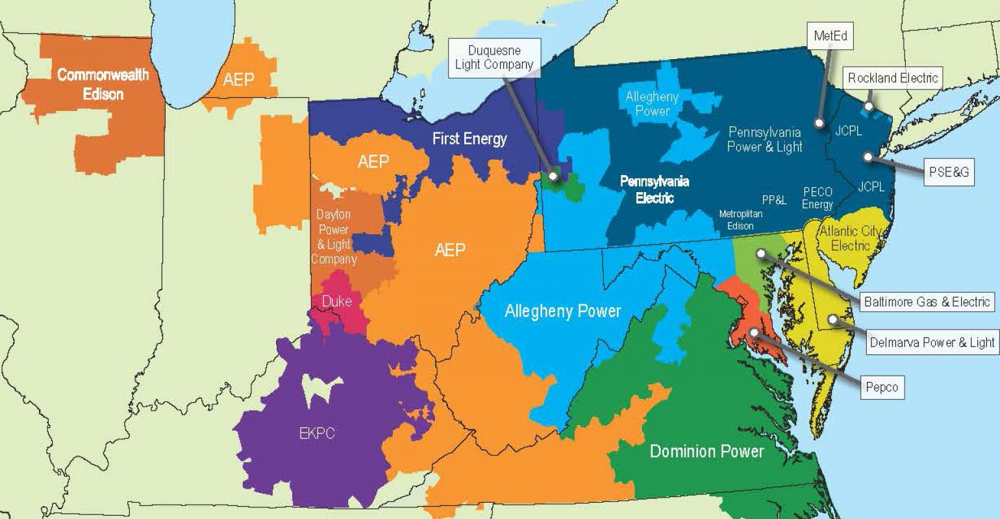

---
jupyter:
  jupytext:
    text_representation:
      extension: .md
      format_name: markdown
      format_version: '1.0'
      jupytext_version: 0.8.3
  kernelspec:
    display_name: Python 3
    language: python
    name: python3
  language_info:
    codemirror_mode:
      name: ipython
      version: 3
    file_extension: .py
    mimetype: text/x-python
    name: python
    nbconvert_exporter: python
    pygments_lexer: ipython3
    version: 3.6.1
---

# Orientações:

### Dataset - Dados de consumo de energia por hora PJM

A PJM Interconnection LLC (PJM) é uma organização de transmissão regional (RTO) nos Estados Unidos. Faz parte da rede de Interconexão Oriental que opera um sistema de transmissão elétrica que atende a todas ou partes de Delaware, Illinois, Indiana, Kentucky, Maryland, Michigan, Nova Jersey, Carolina do Norte, Ohio, Pensilvânia, Tennessee, Virgínia, Virgínia Ocidental e Distrito. de Columbia.

Os dados de consumo de energia por hora vêm do site da PJM e estão em megawatts (MW).

As regiões mudaram ao longo dos anos, portanto, os dados podem aparecer apenas para determinadas datas por região.

Idéias do que você poderia fazer com este conjunto de dados:

Dividir o último ano em um conjunto de testes - você pode construir um modelo para prever o consumo de energia?

Encontre tendências no consumo de energia em horários do dia, feriados ou tendências de longo prazo?

Entenda como as tendências diárias mudam dependendo da época do ano. As tendências de verão são muito diferentes das tendências de inverno.

## Problema

Um clinte internacional da SolarView sabendo que temos um grande conhecimento em análise de energia em séries temporais pediu para realizarmos uma análise exploratória de dados para entender melhor sobre o proprio negocio. A ideia é aplicarmos modelos de machine learning para realizar a previsão do consumo de energia em megawatts (MW). Porém ele enviou diversas bases de dados, precisamos com rapidez de uma análise, o objetivo e enviar tanto um SQL quanto uma análise exploratória dos dados para nosso pesquisador de machine learning dar segmento.

## Tarefas:

Como um cientista de dados você deverá estar sempre pronto para sair da sua zona de conforto. Para isso você deverá realizar essa tarefa inicialmente em Python, porém, você pode poupar muito tempo utilizando R. Você pode escolher, mas um bom cientista de dados não pode se apegar a linguagem, você deve tanto saber R como Python.

1. Você deverá criar um banco de dados que vai conter todas as bases de dados, na pasta "data" você vai encontrar 14 arquivos .CSV. A forma que esses dados serão organizados vai depender de você, mas lembre de gestão colaborativa de dados. Outro funcionário da SolarView deverá conseguir criar tabelas atraves do seu SQL, ele não terá tempo de organizar os dados, todo processo deverá estar bem sucinto. 

2. Realizar uma análise exploratória dos dados utilizando vizualizações de dados, análise estátistica e análise de séries temporais. Lembre-se aqui vai contar muito como você ira contar a história desses dados.

3. Gerar um relatório sobre o consumo de energia em Megawatts, você pode escolher uma análise uni variavel ou multi variavel, porém lembre que a escolha das variaveis para se trabalhar e tarefa chave de um cientista de dados.

## Perguntas:

1. Ao explorar séries temporais, quais são os seus principais objetivos?

2. Pensando no negócio da SolarView, como você entende a contribuição das análises de séries temporais? 

3. Pensando em séries temporais novamente, que tipos de algoritimos de inteligência você julga relevantes para a SolarView?

4. Após realizar as tarefas acimas, você entendeu um pouco mais sobre análise de consumo de energia, como você entende que a SolarView pode tirar maior proveito de análises desse tipo?
